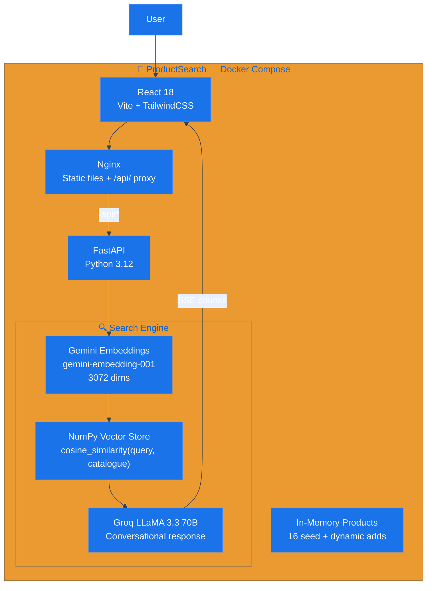
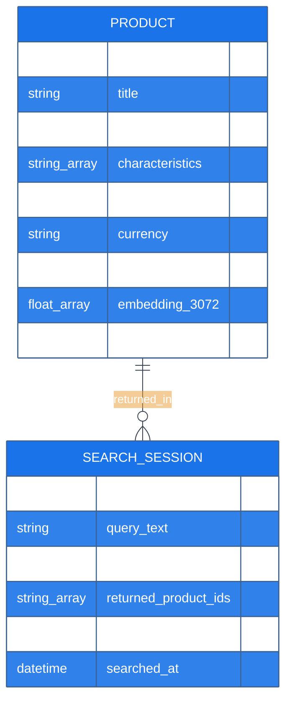

# ProductSearch — Recherche produit multimodale par IA

> Trouvez n'importe quel produit par description naturelle ou par photo. Résultats conversationnels en temps réel.

[](https://fastapi.tiangolo.com)
[](https://reactjs.org)
[](https://ai.google.dev)
[](https://groq.com)

---

## Vue d'ensemble

ProductSearch est un moteur de recherche produit multimodal combinant embeddings vectoriels Gemini (3072 dimensions) et LLM conversationnel Groq LLaMA 3.3 70B. L'utilisateur décrit son besoin en langage naturel ou envoie une photo — le moteur retrouve les produits sémantiquement proches et génère une réponse conversationnelle avec les résultats contextualisés. Le catalogue est administrable en temps réel via un onglet Admin intégré.

**Live :** [productsearch.wikolabs.com](https://productsearch.wikolabs.com)  
**Domaine :** E-commerce / Product Discovery / Conversational Search

---

## Stack technique

| Couche | Technologie | Rôle |
|--------|------------|------|
| Frontend | React 18, TypeScript, TailwindCSS, Vite | Interface recherche + admin catalogue |
| Backend | FastAPI (Python 3.12), Uvicorn | API search, chat SSE, gestion produits |
| Embeddings | Google Gemini `gemini-embedding-001` (3072-dim) | Vectorisation produits et requêtes |
| LLM | Groq LLaMA 3.3 70B (streaming SSE) | Réponses conversationnelles |
| Vector Store | NumPy (in-memory cosine similarity) | Recherche rapide sans base de données |
| Infra | Docker Compose, Nginx | Conteneurisation, reverse proxy /api/ |

### backend/requirements.txt
```
fastapi==0.111.0
uvicorn[standard]==0.29.0
google-generativeai==0.7.2
groq==0.9.0
numpy==1.26.4
pydantic==2.7.1
python-multipart==0.0.9
pillow==10.3.0
pytest==8.2.0
```

---

## Architecture mono-repo

```
productsearch/
├── frontend/
│   ├── src/
│   │   ├── App.tsx               # Routing : Search ↔ Admin tabs
│   │   ├── components/
│   │   │   ├── SearchBar.tsx     # Input texte + upload image
│   │   │   ├── ProductCard.tsx   # Carte produit (image, titre, prix)
│   │   │   ├── ChatMessage.tsx   # Réponse LLM avec produits intégrés
│   │   │   └── AdminForm.tsx     # Formulaire ajout produit
│   │   └── api/
│   │       └── client.ts         # Fetch REST + SSE streaming
│   └── vite.config.ts
├── backend/
│   ├── main.py                   # FastAPI app + routes
│   ├── models.py                 # Pydantic schemas
│   ├── embeddings.py             # Gemini embed + cosine search
│   ├── chat.py                   # Groq streaming chat
│   ├── products.py               # In-memory product store
│   ├── seed_products.py          # 16 produits initiaux
│   ├── tests/
│   │   └── test_api.py
│   ├── requirements.txt
│   └── Dockerfile
├── nginx.conf
├── docker-compose.yml
└── .github/workflows/deploy.yml
```

---

## Diagrammes UML

### Architecture système



### Séquence — Recherche multimodale (texte + photo)

```mermaid
%%{init: {'theme': 'base', 'themeVariables': {'primaryColor': '#1a73e8', 'primaryTextColor': '#fff', 'lineColor': '#374151'}}}%%
sequenceDiagram
    participant USER as User
    participant REACT as React 18
    participant API as FastAPI
    participant GEMINI as Gemini API
    participant NUMPY as Vector Store
    participant GROQ as Groq LLaMA

    USER->>REACT: Upload photo + "quelque chose pour écouter de la musique"

    REACT->>API: POST /search {query: "...", image: "data:image/jpeg;base64,..."}

    API->>GEMINI: embed_content(text="quelque chose pour écouter...")
    GEMINI-->>API: text_vector [3072 dims]

    API->>GEMINI: embed_content(image=base64_jpg, model=gemini-embedding-001)
    Note over GEMINI: Encode image as 3072-dim embedding
    GEMINI-->>API: image_vector [3072 dims]

    Note over API: Fusion: combined = 0.5 × text_vec + 0.5 × image_vec

    API->>NUMPY: cosine_similarity(combined_vector, product_matrix)
    NUMPY-->>API: top_5 [{id, title, score: 0.94}, ...]

    API->>GROQ: POST /chat/completions {products: top_5, query: "..."}
    Note over GROQ: Stream via SSE — tokens en temps réel
    GROQ-->>API: "J'ai trouvé ces casques parfaitement adaptés..." (stream)
    API-->>REACT: SSE chunks → affichage temps réel

    REACT-->>USER: Message chat + 5 ProductCards affichées
```

### Modèle de données



---

## PRD

### Problème
Les moteurs de recherche e-commerce classiques échouent quand l'utilisateur ne connaît pas le nom exact du produit. "Un truc pour les oreilles sans fil" ne retourne rien dans un search par mots-clés. La recherche par image est absente de la majorité des catalogues PME.

### Solution
ProductSearch utilise les embeddings multimodaux Gemini pour comprendre texte et image simultanément, retrouve les produits sémantiquement proches même avec des descriptions imprécises, et génère une réponse conversationnelle contextualisée via LLM.

### Utilisateurs cibles
| Persona | Besoin |
|---------|--------|
| Acheteur en ligne | Trouver un produit qu'il ne sait pas nommer exactement |
| Gestionnaire catalogue | Ajouter/modifier des produits sans pipeline complexe |
| Développeur | Prototype de moteur sémantique intégrable |

### OKRs
- Pertinence résultats (top-1 match) : ≥ 85% sur catalogue test
- Latence embedding + search : < 500 ms
- Première token LLM : < 800 ms

---

## User Stories

```
US-01 [Acheteur] En tant qu'acheteur,
      je veux décrire un produit en langage naturel
      et voir les 5 produits les plus pertinents avec une explication
      afin de trouver ce que je cherche sans connaître le nom exact.

US-02 [Acheteur] En tant qu'acheteur,
      je veux uploader une photo d'un produit vu ailleurs
      et trouver le même ou un similaire dans le catalogue
      afin d'acheter en ligne sans devoir googler le nom.

US-03 [Admin] En tant qu'administrateur catalogue,
      je veux ajouter un nouveau produit via formulaire
      et qu'il soit immédiatement trouvable via la recherche
      afin de maintenir le catalogue à jour en temps réel.

US-04 [Acheteur] En tant qu'acheteur,
      je veux combiner texte et image dans ma recherche
      ("quelque chose comme ça mais en rouge")
      afin d'être encore plus précis.

US-05 [Dev] En tant que développeur,
      je veux voir l'API documentée via Swagger (/docs)
      afin d'intégrer le moteur dans une application tierce.
```

---

## Règles métier

| # | Règle | Description | Simulable UI |
|---|-------|-------------|-------------|
| R1 | Embedding fusion | Image 50% + texte 50% quand les deux sont fournis | ✅ Multimodal search |
| R2 | Top-5 results | 5 produits triés par score cosinus décroissant | ✅ Product cards |
| R3 | Score seuil | Résultats avec score < 0.5 exclus des résultats | ✅ Score badge |
| R4 | Streaming SSE | Réponse LLM streamed token par token | ✅ Chat stream |
| R5 | Catalogue live | Ajout produit → disponible dans la recherche < 1s | ✅ Admin add |
| R6 | Formats image | JPEG, PNG, WebP, max 5 MB | ✅ Upload form |
| R7 | Seed products | 16 produits pré-chargés au démarrage (~10s) | ✅ Browse tab |
| R8 | Contexte LLM | Top-5 produits + détails passés en contexte au LLM | ✅ LLM context |
| R9 | Langue FR | Requêtes et réponses en français | ✅ FR interface |
| R10 | Swagger docs | Documentation API auto-générée sur /docs | ✅ API docs |

---

## Spécification API

### POST /search
```json
{"query": "casque audio sans fil", "image": "data:image/jpeg;base64,..."}
// Response (SSE stream): tokens → réponse conversationnelle avec références produits
```

### POST /chat
```json
{"message": "je cherche un cadeau pour un amateur de café", "history": []}
// Response (SSE): stream de tokens LLaMA 3.3
```

### POST /products
```
Content-Type: multipart/form-data
Fields: title, description, characteristics (JSON), price, currency, image (optional)
// Response: {"id": "prod_xyz", "embedding_dims": 3072, "immediately_searchable": true}
```

### GET /products
```json
// Response: {"products": [{id, title, description, price, currency, image_url}], "count": 16}
```

---

## Simulation UI

| Composant | Description |
|-----------|-------------|
| **Search Bar** | Input texte libre + bouton upload image (drag & drop) |
| **Chat Stream** | Messages LLM avec ProductCards intégrées dans la réponse |
| **Product Card** | Image, titre, description courte, prix, badge score pertinence |
| **Admin Form** | Titre, description, caractéristiques, prix, photo → ajout catalogue |

---

## Déploiement

```yaml
version: "3.9"
services:
  backend:
    build: ./backend
    environment:
      GOOGLE_API_KEY: "${GOOGLE_API_KEY}"
      GROQ_API_KEY: "${GROQ_API_KEY}"
    expose: ["8000"]
  frontend:
    build:
      context: ./frontend
      args:
        VITE_API_URL: ""
    expose: ["80"]
  nginx:
    image: nginx:alpine
    ports: ["80:80"]
    volumes: [./nginx.conf:/etc/nginx/conf.d/default.conf]
```

---

## Roadmap

### Phase 1 — MVP ✅
- [x] Recherche sémantique texte (Gemini embeddings)
- [x] Chat conversationnel streaming (Groq LLaMA)
- [x] Admin catalogue (ajout temps réel)

### Phase 2 — Multimodal ✅
- [x] Recherche par image (Gemini embedding image)
- [x] Fusion vecteur texte + image

### Phase 3 — Production
- [ ] Persistance PostgreSQL + pgvector (replace NumPy in-memory)
- [ ] Pagination et filtres (prix, catégorie)
- [ ] Analytics recherches (termes populaires, zero-results)

---

*Un produit [Wikolabs](https://wikolabs.com) — Intelligence artificielle appliquée aux métiers*
